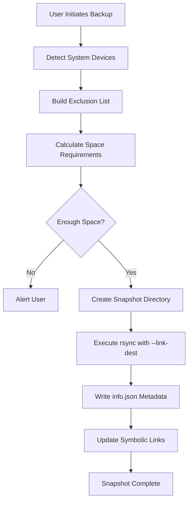

# LinuxRollback - Project Exhibition Guide

## 🎯 Quick Introduction (30-Second Pitch)

> "LinuxRollback is a **system restore utility for Linux** that works like Windows System Restore or macOS Time Machine. It creates incremental filesystem snapshots allowing users to roll back their entire operating system to a previous working state. Our implementation supports both **RSYNC mode** (works on any filesystem) and **BTRFS mode** (native snapshots), making it versatile across all Linux distributions."

---

## 📊 Project Architecture

### High-Level Architecture Diagram

```
┌─────────────────────────────────────────────────────────────────────────────┐
│                           LinuxRollback Application                          │
├─────────────────────────────────────────────────────────────────────────────┤
│                                                                              │
│  ┌─────────────────┐          ┌─────────────────────────────────────────┐   │
│  │   GUI Layer     │          │           Console Layer                  │   │
│  │   (AppGtk)      │          │           (AppConsole)                   │   │
│  │   ┌──────────┐  │          │   ┌──────────────────────────────────┐   │   │
│  │   │MainWindow│  │          │   │ CLI Commands: --create, --restore │   │   │
│  │   │BackupWind│  │          │   │ --delete, --list, --check         │   │   │
│  │   │RestoreWnd│  │          │   └──────────────────────────────────┘   │   │
│  │   │SettingsWd│  │          │                                          │   │
│  │   └──────────┘  │          │   For automation & scripting             │   │
│  └────────┬────────┘          └─────────────────┬───────────────────────┘   │
│           │                                      │                           │
│           └──────────────┬───────────────────────┘                           │
│                          ▼                                                   │
│  ┌───────────────────────────────────────────────────────────────────────┐  │
│  │                         Core Layer (Main.vala)                         │  │
│  ├───────────────────────────────────────────────────────────────────────┤  │
│  │  • Snapshot management (create, delete, restore)                       │  │
│  │  • Scheduling logic (hourly, daily, weekly, monthly, boot)             │  │
│  │  • Device detection and mounting                                       │  │
│  │  • Configuration management                                            │  │
│  │  • Exclusion/inclusion filter management                               │  │
│  └───────────────────────────────────────────────────────────────────────┘  │
│                          │                                                   │
│           ┌──────────────┼──────────────┐                                    │
│           ▼              ▼              ▼                                    │
│  ┌─────────────┐  ┌─────────────┐  ┌─────────────┐                          │
│  │ Snapshot    │  │ SnapshotRepo│  │  Subvolume  │                          │
│  │ (Model)     │  │ (Repository)│  │  (BTRFS)    │                          │
│  │             │  │             │  │             │                          │
│  │ • Metadata  │  │ • Load/Save │  │ • Subvolume │                          │
│  │ • Tags      │  │ • Validate  │  │   mapping   │                          │
│  │ • Comments  │  │ • Index     │  │ • @ and     │                          │
│  │ • info.json │  │ • Organize  │  │   @home     │                          │
│  └─────────────┘  └─────────────┘  └─────────────┘                          │
│                          │                                                   │
│  ┌───────────────────────────────────────────────────────────────────────┐  │
│  │                         Utility Layer                                  │  │
│  ├───────────────────────────────────────────────────────────────────────┤  │
│  │  ┌──────────────┐  ┌──────────────┐  ┌──────────────┐                 │  │
│  │  │  RsyncTask   │  │   Device     │  │  AsyncTask   │                 │  │
│  │  │              │  │              │  │              │                 │  │
│  │  │ • Execute    │  │ • Partition  │  │ • Background │                 │  │
│  │  │   rsync      │  │   detection  │  │   operations │                 │  │
│  │  │ • Hard-links │  │ • LUKS/LVM   │  │ • Progress   │                 │  │
│  │  │ • Progress   │  │ • Mount ops  │  │   tracking   │                 │  │
│  │  └──────────────┘  └──────────────┘  └──────────────┘                 │  │
│  │                                                                        │  │
│  │  ┌──────────────┐  ┌──────────────┐  ┌──────────────┐                 │  │
│  │  │   CronTab    │  │ SystemUser   │  │ TeeJee.*     │                 │  │
│  │  │              │  │              │  │              │                 │  │
│  │  │ • Scheduled  │  │ • User mgmt  │  │ • FileSystem │                 │  │
│  │  │   backups    │  │ • Permissions│  │ • Process    │                 │  │
│  │  │ • Cron jobs  │  │ • Home dirs  │  │ • Logging    │                 │  │
│  │  └──────────────┘  └──────────────┘  └──────────────┘                 │  │
│  └───────────────────────────────────────────────────────────────────────┘  │
│                          │                                                   │
│                          ▼                                                   │
│  ┌───────────────────────────────────────────────────────────────────────┐  │
│  │                      System Layer (Linux)                              │  │
│  ├───────────────────────────────────────────────────────────────────────┤  │
│  │   rsync          btrfs-progs       GRUB2         /etc/fstab           │  │
│  │   lsblk          blkid             cryptsetup    systemd              │  │
│  └───────────────────────────────────────────────────────────────────────┘  │
│                                                                              │
└─────────────────────────────────────────────────────────────────────────────┘
```

### Directory Structure

```
linuxrollback/
├── src/
│   ├── AppConsole.vala      # CLI entry point (34KB)
│   ├── AppGtk.vala          # GUI entry point (4KB)
│   │
│   ├── Core/                # Business Logic
│   │   ├── Main.vala        # Core engine (128KB, 4500+ lines)
│   │   ├── Snapshot.vala    # Snapshot data model
│   │   ├── SnapshotRepo.vala # Repository management
│   │   ├── Subvolume.vala   # BTRFS subvolume handling
│   │   └── AppExcludeEntry.vala
│   │
│   ├── Gtk/                 # GUI Components (32 files)
│   │   ├── MainWindow.vala  # Main application window
│   │   ├── BackupWindow.vala
│   │   ├── RestoreWindow.vala
│   │   ├── SettingsWindow.vala
│   │   └── ... (wizards, dialogs, helpers)
│   │
│   └── Utility/             # Helper Classes (26 files)
│       ├── Device.vala      # Disk/partition management
│       ├── RsyncTask.vala   # Rsync operations
│       ├── AsyncTask.vala   # Async background tasks
│       ├── CronTab.vala     # Scheduling
│       └── TeeJee.*.vala    # Utility libraries
│
├── debian/                  # Debian packaging
├── archlinux/               # Arch Linux packaging
├── po/                      # Translations (66 languages)
└── icons/                   # Application icons
```

---

## 🔧 Technical Stack

| Component | Technology |
|-----------|------------|
| **Language** | Vala (compiled to C via GNOME's valac) |
| **GUI Framework** | GTK3 (libgtk-3) |
| **Build System** | Meson |
| **Backup Engine** | rsync (with hard-links) |
| **Filesystem** | BTRFS native snapshots, ext4, XFS |
| **Data Format** | JSON (for configuration and metadata) |
| **Scheduling** | Cron jobs |

---

## 🔄 How It Works

### RSYNC Mode - Backup Flow



### Key rsync Command

```bash
rsync -aii \
    --recursive \
    --delete \
    --delete-after \
    --force \
    --stats \
    --sparse \
    --link-dest=<previous_snapshot> \
    --exclude-from=<exclude_list> \
    / <snapshot_path>
```

**Why hard-links?** Files unchanged between snapshots share the same disk blocks, saving up to **90% disk space**.

### BTRFS Mode

```bash
# Create read-only snapshot
btrfs subvolume snapshot -r /@ /timeshift/snapshots/<name>/@
btrfs subvolume snapshot -r /@home /timeshift/snapshots/<name>/@home
```

**Advantage:** Near-instantaneous, Copy-on-Write (CoW), minimal overhead.

---

## 🌟 Key Features

### 1. **Dual Snapshot Modes**
- **RSYNC**: Works on any Linux filesystem (ext4, XFS, etc.)
- **BTRFS**: Native filesystem snapshots with CoW efficiency

### 2. **Smart Scheduling**
- Hourly, Daily, Weekly, Monthly, Boot-time snapshots
- Configurable retention policies per level

### 3. **Space-Efficient Storage**
- Hard-links for RSYNC mode
- Copy-on-Write for BTRFS mode
- Each snapshot is browsable as complete filesystem

### 4. **System-Only Focus**
- Excludes user data by default (Documents, Pictures, Music)
- Protects system files and configurations

### 5. **Comprehensive System Support**
- LUKS-encrypted partitions
- LVM2 volumes
- GRUB2 bootloader integration
- EFI support

### 6. **Cross-Distribution Restore**
- Restore snapshots across different Linux distributions
- Automatic bootloader reinstallation

---

## ❓ Potential Judge Questions & Answers

### Category 1: Project Overview

#### Q1: What problem does LinuxRollback solve?

> **Answer:** LinuxRollback solves the critical problem of **system recovery after failures**. When users install bad drivers, broken updates, or misconfigure their system, they often face a non-bootable system. LinuxRollback allows them to restore their entire operating system to a known good state within minutes, similar to how Windows System Restore or macOS Time Machine works, but specifically designed for Linux.

#### Q2: Why did you choose to modify Timeshift instead of building from scratch?

> **Answer:** We chose to build upon Timeshift for several strategic reasons:
> 1. **Proven Stability**: Timeshift is maintained by Linux Mint and has millions of active users
> 2. **Comprehensive Foundation**: It already handles complex scenarios like LUKS encryption, LVM, and GRUB2
> 3. **Focus on Innovation**: By extending a solid base, we could focus on adding new features rather than reinventing core functionality
> 4. **Real-world Testing**: The codebase has been battle-tested across multiple distributions

#### Q3: What are the unique features your team added?

> **Answer:** Our team enhanced LinuxRollback with:
> - **User Configuration Backup**: Ability to selectively backup user settings and dotfiles
> - **Snapshot Changes Viewer**: Visual diff showing exactly what changed between snapshots
> - **Export Functionality**: Export snapshots to external drives for offsite backup
> - **Modern Header Bar UI**: Updated GTK interface with better usability
> - **Optimized Size Calculation**: Faster snapshot size computation with queued I/O

---

### Category 2: Technical Architecture

#### Q4: Why did you use Vala as the programming language?

> **Answer:** Vala was chosen because:
> 1. **GObject Integration**: Native integration with GNOME libraries (GTK, GLib, GIO)
> 2. **C-like Performance**: Compiles to C code, providing native performance
> 3. **Memory Safety**: Reference counting and nullable types reduce memory bugs
> 4. **Linux Focus**: Perfect for system-level applications on Linux
> 5. **Codebase Continuity**: Original Timeshift was written in Vala

#### Q5: Explain the difference between RSYNC and BTRFS modes.

> **Answer:**
>
> | Aspect | RSYNC Mode | BTRFS Mode |
> |--------|------------|------------|
> | **Mechanism** | File-level copy with hard-links | Filesystem-level Copy-on-Write |
> | **Speed** | Slower (reads all files) | Near-instantaneous |
> | **Space** | Efficient via hard-links | Extremely efficient via CoW |
> | **Compatibility** | Any filesystem | Only BTRFS |
> | **Granularity** | File-level control | Block-level (entire subvolume) |
> | **Portability** | Snapshots are portable | Tied to BTRFS volume |

#### Q6: How does the hard-link mechanism save disk space?

> **Answer:** When rsync creates a snapshot with `--link-dest`, it compares each file with the previous snapshot. If a file is **unchanged**, instead of copying it, rsync creates a **hard-link** pointing to the same inode (disk location). This means:
> - Multiple snapshots share identical files
> - Only modified or new files consume additional space
> - A 20GB system with 5 daily snapshots might only use 25GB total (not 100GB)
> - Each snapshot still appears as a complete, browsable filesystem

#### Q7: What is the role of `info.json` in snapshots?

> **Answer:** The `info.json` file stores critical metadata about each snapshot:
> ```json
> {
>   "backup-datetime": "2024-12-10 10:30:00",
>   "sys-uuid": "abc123-def456",
>   "sys-distro": "Ubuntu 22.04",
>   "app-version": "25.07.7",
>   "tags": ["D"],
>   "comments": "Pre-upgrade backup",
>   "live": false,
>   "subvolumes": {...}
> }
> ```
> This enables snapshot identification, filtering, and ensures restoration compatibility.

---

### Category 3: Technical Deep-Dive

#### Q8: How does the application detect and handle encrypted partitions?

> **Answer:** The `Device.vala` utility class handles encrypted partitions through:
> 1. **Detection**: Parses `lsblk -J` and `blkid` output to identify LUKS-encrypted volumes
> 2. **Decryption**: Uses `cryptsetup luksOpen` to unlock LUKS containers
> 3. **LVM Handling**: Activates LVM volumes within encrypted containers using `vgchange -a y`
> 4. **Mounting**: Mounts the decrypted filesystems for backup/restore
> 5. **Cleanup**: Safely closes LUKS containers after operations complete

#### Q9: How is the scheduling system implemented?

> **Answer:** Scheduling is implemented via Linux cron:
> 1. A cron job runs the application hourly: `/etc/cron.d/timeshift-hourly`
> 2. `Main.vala`'s `check_backups()` method determines if a snapshot is "due"
> 3. It checks the last timestamp for each level (daily, weekly, monthly)
> 4. If the configured interval has elapsed, it creates a snapshot with the appropriate tag
> 5. Old snapshots exceeding the retention count are automatically deleted

#### Q10: What happens during a system restore?

> **Answer:** The restore process involves:
> 1. **Target Selection**: User selects snapshot and target device(s)
> 2. **Pre-checks**: Validates snapshot integrity and target space
> 3. **Mounting**: Mounts target root partition (handles LUKS/LVM if needed)
> 4. **Rsync Restore**: Copies files from snapshot to target:
>    ```bash
>    rsync -avh --delete <snapshot>/ <target>/
>    ```
> 5. **Bootloader Repair**: Reinstalls GRUB2 to target disk
> 6. **fstab Update**: Updates `/etc/fstab` with correct UUIDs
> 7. **initramfs**: Rebuilds initramfs for new configuration
> 8. **Hooks**: Executes user scripts from `/etc/timeshift/restore-hooks.d/`

---

### Category 4: Challenges & Solutions

#### Q11: What was the most challenging part of development?

> **Answer:** The most challenging aspects were:
> 1. **Device Detection**: Handling diverse hardware configurations (LUKS, LVM, RAID, NVMe, SATA)
> 2. **BTRFS Subvolume Layout**: Supporting Ubuntu-style @ and @home while handling edge cases
> 3. **Live System Restore**: Implementing safe online restore without corrupting the running system
> 4. **Progress Reporting**: Parsing rsync output in real-time for accurate progress display
> 5. **Cross-Distro Compatibility**: Ensuring GRUB2 reinstallation works across different distributions

#### Q12: How do you handle the running system during restore?

> **Answer:** For online (live) restoration:
> 1. The restore is performed on a **mounted target** (not the active root)
> 2. A system reboot is required to complete the process
> 3. The new root takes effect after reboot
> 4. For truly broken systems, users can boot from a **Live USB**, install LinuxRollback on the live environment, and restore to the installed system (offline restore)

#### Q13: How do you ensure data integrity during backup?

> **Answer:** Data integrity is ensured through:
> 1. **Rsync's --checksum**: Optional verification of transferred files
> 2. **info.json**: Metadata validation before restore
> 3. **Atomic Operations**: Snapshots marked incomplete until fully written
> 4. **Orphan Detection**: Missing files identified during restore
> 5. **Pre-restore Validation**: Checks snapshot completeness before restoration

---

### Category 5: Security & Edge Cases

#### Q14: How does LinuxRollback handle encrypted home directories?

> **Answer:** For ecryptfs-encrypted home directories:
> - **Backed up**: Files in `/home/.ecryptfs/$USER` (encrypted form)
> - **Excluded**: Decrypted contents in `/home/$USER`
>
> This maintains security by:
> 1. Never storing decrypted sensitive data in snapshots
> 2. Preserving the encrypted blobs for valid restoration
> 3. Users can decrypt after restore using their passphrase

#### Q15: What security measures protect saved snapshots?

> **Answer:**
> 1. **Root-only Access**: Snapshots stored in `/timeshift` require root privileges
> 2. **Permissions Preserved**: File permissions/ownership maintained via rsync `-a` flag
> 3. **No Network Exposure**: Local-only storage, no cloud sync by default
> 4. **LUKS Support**: Snapshots can be stored on encrypted devices
> 5. **User Data Exclusion**: Sensitive user files excluded by default

---

### Category 6: Future & Improvements

#### Q16: What improvements would you make with more time?

> **Answer:**
> 1. **GTK4 Migration**: Modern UI with better animations and themes
> 2. **ZFS Support**: Native ZFS snapshot integration
> 3. **Cloud Backup**: Optional sync to AWS S3/Google Cloud
> 4. **Encryption at Rest**: Encrypt snapshots themselves
> 5. **Deduplication**: Content-based deduplication beyond hard-links
> 6. **REST API**: For integration with automation tools
> 7. **Automated Testing**: CI/CD pipeline with comprehensive tests

#### Q17: How would this scale for enterprise use?

> **Answer:** For enterprise scaling:
> 1. **Centralized Management**: REST API + Web Dashboard
> 2. **Network Storage**: NFS/SMB mount support for centralized snapshots
> 3. **Policy Engine**: Compliance-driven retention policies
> 4. **Alerting**: Email/Slack notifications for backup status
> 5. **Reporting**: Detailed audit logs and reports
> 6. **Multi-System**: Manage multiple endpoints from single console

---

### Category 7: Comparison & Market

#### Q18: How does LinuxRollback compare to alternatives?

> **Answer:**
>
> | Feature | LinuxRollback | Snapper | BackInTime | Duplicity |
> |---------|---------------|---------|------------|-----------|
> | BTRFS Snapshots | ✅ | ✅ | ❌ | ❌ |
> | RSYNC Mode | ✅ | ❌ | ✅ | ❌ |
> | GUI Interface | ✅ | ⚠️ YaST | ✅ | ❌ |
> | System-Only Focus | ✅ | ❌ | ❌ | ❌ |
> | Cross-Distro Restore | ✅ | ❌ | ❌ | ❌ |
> | Encryption Support | ✅ | ✅ | ❌ | ✅ |
>
> **Unique Value**: Only tool that combines both RSYNC and BTRFS with a system-focused approach.

#### Q19: Who is the target user for this application?

> **Answer:**
> 1. **Linux Desktop Users**: Protection against system failures
> 2. **System Administrators**: Server configuration snapshots
> 3. **Developers**: Safe experimentation on development machines
> 4. **Linux Enthusiasts**: Distro-hoppers who switch frequently
> 5. **Educational Institutions**: Lab machines that need frequent reset

---

### Category 8: Live Demo Points

#### Things to Demonstrate:
1. ✅ Create a manual snapshot
2. ✅ Show snapshot list with tags (D, W, M, O)
3. ✅ Browse snapshot contents in file manager
4. ✅ View changes between snapshots
5. ✅ Show scheduling configuration
6. ✅ Demonstrate export functionality
7. ✅ Show space efficiency (hard-link visualization with `df -h`)

---

## 📝 Quick Reference - Key Stats

| Metric | Value |
|--------|-------|
| **Codebase Size** | ~82 source files |
| **Lines of Code** | ~15,000+ lines (Vala) |
| **Core Module** | Main.vala (4,500+ lines) |
| **Supported Languages** | 66 translations |
| **Primary License** | GPL-2.0-or-later |
| **Build System** | Meson 0.54+ |
| **GUI Framework** | GTK3 |
| **Backup Modes** | RSYNC + BTRFS |

---

## 🎤 Final Tips for the Presentation

1. **Start with the problem**: Everyone has faced a broken system after a bad update
2. **Demo is powerful**: A live snapshot creation beats 100 slides
3. **Know your numbers**: Mention space savings, file counts, snapshot speeds
4. **Prepare for "why not just..."**: Have answers for alternatives (clonezilla, dd, etc.)
5. **Highlight team contributions**: What did YOUR team specifically add/improve?

---

**Good luck with your exhibition! 🚀**
