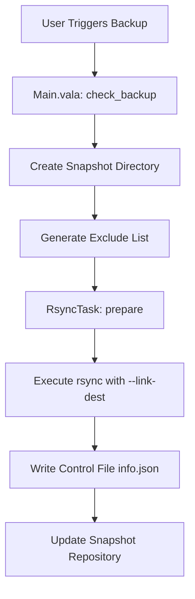

# Timeshift Project - Comprehensive Analysis

## Executive Summary

**Timeshift** is a powerful system restore utility for Linux that provides functionality similar to Windows' System Restore and macOS' Time Machine. Currently maintained by Linux Mint, it creates incremental filesystem snapshots to enable system recovery.

**Version**: 25.07.7  
**Original Author**: Tony George  
**Current Maintainer**: Linux Mint  
**License**: GPL-2.0-or-later  
**Programming Language**: Vala (compiled to C)  
**Build System**: Meson

---

## Project Architecture

### 1. **Core Components**

#### A. **Application Modes**
- **Console Mode** (`AppConsole.vala`): CLI interface for scripting and automation
- **GUI Mode** (`AppGtk.vala`): GTK3-based graphical interface

#### B. **Snapshot Mechanisms**
1. **RSYNC Mode**:
   - Uses `rsync` with hard-links for space efficiency
   - Incremental backups sharing common files
   - Each snapshot is browsable as a complete filesystem
   
2. **BTRFS Mode**:
   - Leverages BTRFS filesystem's native snapshot capabilities
   - Near-instantaneous snapshots with minimal space overhead
   - Requires Ubuntu-style subvolume layout (@ and @home)

### 2. **Directory Structure**

```
timeshift/
├── src/
│   ├── Core/              # Core business logic
│   │   ├── Main.vala      # Main application class (4,537 lines)
│   │   ├── Snapshot.vala  # Snapshot data model
│   │   ├── SnapshotRepo.vala  # Repository management
│   │   ├── AppExcludeEntry.vala
│   │   └── Subvolume.vala
│   ├── Gtk/               # 31 GUI components
│   │   ├── MainWindow.vala
│   │   ├── BackupWindow.vala
│   │   ├── RestoreWindow.vala
│   │   └── ... (settings, wizards, etc.)
│   ├── Utility/           # Helper classes
│   │   ├── Device.vala    # Disk/partition management
│   │   ├── RsyncTask.vala # Rsync operations
│   │   ├── AsyncTask.vala
│   │   ├── CronTab.vala
│   │   └── TeeJee.*.vala  # Utility libraries
│   ├── AppConsole.vala    # Console entry point
│   └── AppGtk.vala        # GUI entry point
├── debian/                # Debian packaging
├── archlinux/             # Arch packaging
├── po/                    # Translations (66 languages)
├── docs/                  # Documentation
└── icons/                 # Application icons
```

### 3. **Key Features**

#### Snapshot Management
- **Automatic Scheduling**: Hourly, Daily, Weekly, Monthly, Boot
- **Manual Snapshots**: On-demand creation with custom tags
- **Smart Retention**: Configurable count per schedule level
- **Live System Detection**: Tracks active snapshots

#### System Protection
- **System Files Only**: User data excluded by default (documents, media)
- **Encrypted Support**: LUKS, LVM2, ecryptfs
- **Cross-Distribution Restore**: Restore across different Linux distros
- **Bootloader Management**: GRUB2 reinstallation, EFI support

#### Advanced Capabilities
- **Space Efficiency**: Hard-links for RSYNC, CoW for BTRFS
- **Hooks System**: Pre/post backup and restore scripts
- **Subvolume Support**: Multiple BTRFS subvolumes
- **Device Auto-detection**: Intelligent partition discovery

---

## How Timeshift Works

### Backup Process (RSYNC Mode)



**Key Steps**:
1. **Initialization**: Detect system devices, mount points, and filesystems
2. **Exclusion Filtering**: Build exclude list (user data, temp files, caches)
3. **Rsync Execution**: 
   ```bash
   rsync -aii --recursive --delete --link-dest=<previous_snapshot> / <snapshot_path>
   ```
4. **Metadata Creation**: Store snapshot info in JSON format
5. **Symbolic Links**: Create level-based symlinks (Daily, Weekly, etc.)

### Backup Process (BTRFS Mode)

```bash
# Create read-only snapshot
btrfs subvolume snapshot -r /@ /timeshift/snapshots/<name>/@
btrfs subvolume snapshot -r /home/@home /timeshift/snapshots/<name>/@home
```

### Restore Process

1. **Device Selection**: Choose target device (can differ from backup source)
2. **Mount Preparation**: Unlock LUKS, mount LVM volumes
3. **File Restoration**: 
   - RSYNC: Copy files while preserving attributes
   - BTRFS: Restore subvolume snapshots
4. **Post-Restore Hooks**: 
   - Update `/etc/fstab`
   - Reinstall GRUB2
   - Update initramfs
   - Run custom scripts in `/etc/timeshift/restore-hooks.d`

---

## Technical Deep Dive

### Device Management (`Device.vala` - 2,159 lines)

**Capabilities**:
- Parse `lsblk`, `blkid`, `df` output
- Handle LUKS encryption/decryption
- Manage LVM2 volumes
- Mount/unmount filesystems
- RAID and dmraid support

**Key Methods**:
- `get_filesystems()`: Enumerate all block devices
- `get_disk_space_using_df()`: Query usage statistics
- `luks_unlock()`: Decrypt encrypted partitions
- `mount_partition()`: Mount with proper options

### Rsync Operations (`RsyncTask.vala`)

**Features**:
- Itemized change detection (created/modified/deleted)
- Log parsing with regex patterns
- Progress tracking
- Hard-link management via `--link-dest`

**Rsync Flags Used**:
```bash
-aii                    # Archive with itemize changes
--recursive             # Recurse into directories
--delete                # Remove extraneous files
--delete-after          # Delete after transfer
--force                 # Allow non-empty dir deletion
--stats                 # File transfer statistics
--sparse                # Handle sparse files efficiently
--link-dest=<path>      # Hard-link unchanged files
--exclude-from=<file>   # Exclusion patterns
```

### Snapshot Repository (`SnapshotRepo.vala`)

**Responsibilities**:
- Load snapshots from disk
- Track snapshot metadata
- Validate snapshot integrity
- Manage BTRFS subvolumes
- Check available disk space

**Snapshot Control File** (`info.json`):
```json
{
  "backup-datetime": "2024-11-23 10:30:00",
  "sys-uuid": "abc123...",
  "sys-distro": "Linux Mint 21",
  "app-version": "25.07.7",
  "tags": ["D"],
  "comments": "Daily backup",
  "live": false,
  "subvolumes": {
    "@": {
      "path": "/@",
      "total_bytes": 123456789,
      "device_uuid": "xyz789..."
    }
  }
}
```

---

## Dependencies

### Build Dependencies
```bash
# Core
meson >= 0.54.0
valac (Vala compiler)
help2man

# Libraries
libgtk-3-dev
libgee-0.8-dev
libjson-glib-dev
libvte-2.91-dev
libxapp-dev
```

### Runtime Dependencies
```bash
rsync                  # RSYNC mode
btrfs-progs           # BTRFS mode
debianutils           # System utilities
```

---

## Configuration Files

### Application Config
- **Path**: `/etc/timeshift/timeshift.json`
- **User Override**: `~/.config/timeshift/timeshift.json`
- **Content**: Schedule settings, backup device, filters

### System Integration
- **Cron Jobs**: `/etc/cron.d/timeshift-hourly`
- **Backup Hooks**: `/etc/timeshift/backup-hooks.d/`
- **Restore Hooks**: `/etc/timeshift/restore-hooks.d/`

---

## Strengths

1. ✅ **Dual Mode Support**: RSYNC for all filesystems, BTRFS for native support
2. ✅ **User-Friendly**: GUI + CLI for different use cases
3. ✅ **Space Efficient**: Hard-links (RSYNC) and CoW (BTRFS)
4. ✅ **Cross-Distribution**: Restore across different Linux flavors
5. ✅ **Well-Tested**: Maintained by Linux Mint, widely deployed
6. ✅ **Extensive Documentation**: Clear README and man pages
7. ✅ **Internationalization**: 66 language translations

---

## Areas for Improvement

### 1. **Modern Architecture**
**Current**: Monolithic `Main.vala` (4,537 lines)  
**Proposed**: 
- Extract business logic into separate services
- Implement dependency injection
- Use MVC/MVVM pattern for GUI

### 2. **Build System Modernization**
**Current**: Meson 0.54.0 (2019)  
**Proposed**:
- Update to latest Meson (1.3+)
- Add CMake alternative for wider compatibility
- Containerized builds (Docker/Podman)

### 3. **Testing Infrastructure**
**Current**: No automated tests visible  
**Proposed**:
- Unit tests for core logic (Vala Test framework)
- Integration tests for rsync/btrfs operations
- GUI tests (GTK testing framework)
- CI/CD pipeline (GitHub Actions)

### 4. **Enhanced Snapshot Features**
- **Incremental Verification**: Checksum validation
- **Compression Support**: Compress snapshots to save space
- **Cloud Backup**: Optional sync to cloud storage
- **Differential Backups**: Track changes between snapshots

### 5. **UI/UX Improvements**
**Current**: GTK3  
**Proposed**:
- Migrate to GTK4 for modern styling
- Add dark mode support
- Snapshot comparison viewer
- Visual timeline of snapshots
- Advanced filtering and search

### 6. **Performance Optimizations**
- **Parallel Operations**: Multi-threaded file transfers
- **Deduplication**: Content-based deduplication (not just hard-links)
- **Smart Scanning**: Only scan changed directories
- **Resource Throttling**: CPU/IO limits during backup

### 7. **New Filesystem Support**
- **ZFS**: Native ZFS snapshot support
- **F2FS**: Flash-Friendly File System
- **XFS**: Better reflink support

### 8. **Security Enhancements**
- **Encryption**: Encrypt snapshots at rest
- **Integrity**: GPG signatures for snapshots
- **Audit Logs**: Detailed operation logging
- **RBAC**: Role-based access control

### 9. **Observability**
- **Metrics**: Prometheus exporter
- **Logging**: Structured logging (JSON)
- **Monitoring**: Snapshot health dashboard
- **Alerts**: Email/webhook notifications

### 10. **Developer Experience**
- **API**: RESTful API for automation
- **Plugin System**: Extensible hooks
- **Better Documentation**: Architectural diagrams, API docs
- **Code Quality**: Static analysis, linting

---

## Technology Stack Recommendations

### For Modernization

#### Option 1: Stay with Vala/GTK (Conservative)
**Pros**: 
- Minimal code rewrite
- Existing codebase knowledge
- Native performance

**Cons**:
- Limited developer ecosystem
- Harder to find contributors

#### Option 2: Rust + GTK4 (Recommended)
**Pros**:
- Memory safety
- Modern async/await
- Great ecosystem (clap, serde, tokio)
- Active GTK4 bindings (gtk-rs)

**Cons**:
- Complete rewrite required
- Learning curve

#### Option 3: Go + Web UI
**Pros**:
- Easy deployment (single binary)
- Modern web frontend (React/Vue)
- Better scalability

**Cons**:
- Loses native feel
- Requires web server

---

## Upgrade Roadmap (Suggested)

### Phase 1: Foundation (3 months)
- [ ] Add unit tests for core modules
- [ ] Set up CI/CD pipeline
- [ ] Migrate to Meson 1.3+
- [ ] Update GTK dependencies to GTK4
- [ ] Code documentation improvements

### Phase 2: Architecture Refactor (6 months)
- [ ] Extract Main.vala into services
- [ ] Implement plugin system
- [ ] Add REST API layer
- [ ] Create comprehensive test suite
- [ ] Performance profiling and optimization

### Phase 3: Feature Expansion (6 months)
- [ ] ZFS/XFS snapshot support
- [ ] Cloud backup integration
- [ ] Snapshot compression
- [ ] Advanced comparison tools
- [ ] Monitoring and metrics

### Phase 4: UI Modernization (4 months)
- [ ] GTK4 migration completion
- [ ] Dark mode support
- [ ] Improved UX flows
- [ ] Accessibility improvements
- [ ] Mobile-friendly web portal

---

## Competitive Analysis

| Feature | Timeshift | Snapper | BackInTime | Duplicity |
|---------|-----------|---------|------------|-----------|
| BTRFS Support | ✅ | ✅ | ❌ | ❌ |
| RSYNC Mode | ✅ | ❌ | ✅ | ❌ |
| GUI | ✅ | ⚠️ (YaST) | ✅ | ❌ |
| System-Only | ✅ | ❌ | ❌ | ❌ |
| Cross-Distro | ✅ | ❌ | ❌ | ❌ |
| Encryption | ❌ | ❌ | ❌ | ✅ |

**Timeshift's Unique Value**: Only tool focused on system restoration with both RSYNC and BTRFS support.

---

## Community and Ecosystem

- **GitHub Stars**: ~10k+
- **Active Development**: Yes (Linux Mint team)
- **Issue Tracker**: GitHub Issues
- **Translation**: Launchpad
- **Package Availability**: Debian, Arch, Fedora, Ubuntu

---

## Conclusion

Timeshift is a mature, well-designed system restoration tool with strong fundamentals. It excels at its core mission: protecting Linux systems from catastrophic failures. However, to reach the "next level," consider:

1. **Modernize the codebase** (testing, CI/CD, architecture)
2. **Expand functionality** (compression, cloud, encryption)
3. **Improve developer experience** (API, plugins, documentation)
4. **Enhance UI/UX** (GTK4, modern design, accessibility)

The foundation is solid—incremental improvements will make it best-in-class.

---

**Questions to Consider**:
1. What is your primary goal? (Performance? Features? Maintainability?)
2. Do you want to stay with Vala or consider alternatives?
3. Are you targeting personal use, enterprise, or cloud deployment?
4. What timeline do you have for upgrades?

Let me know how you'd like to proceed with specific improvements!
